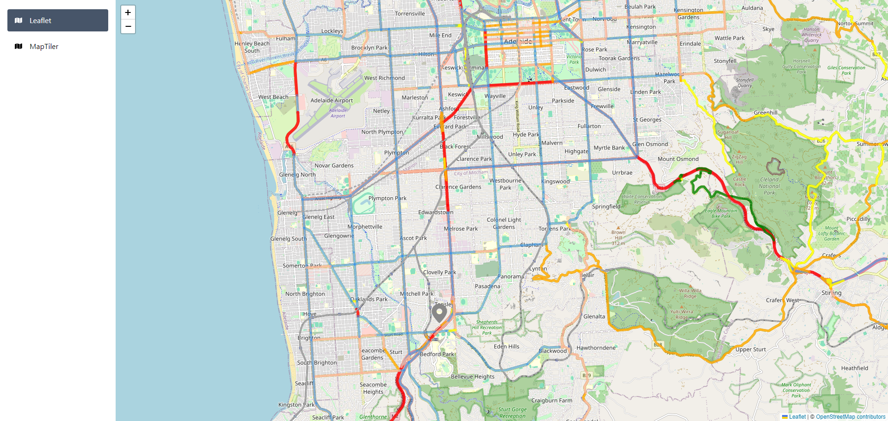
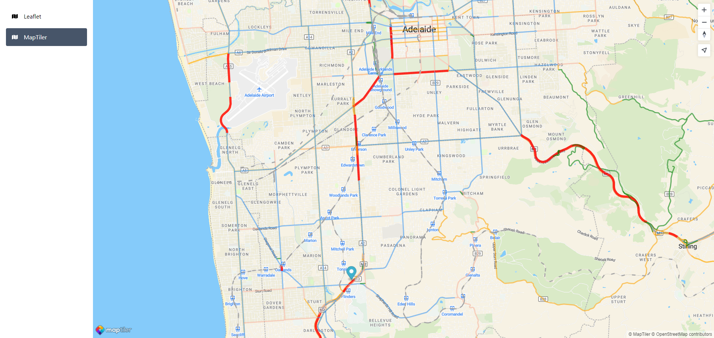

# Leaflet and MapTiler with React using Vite, TypeScript, and Tailwind CSS

This is a test project for learning how to use Leaflet and MapTiler with React using Vite, TypeScript, and Tailwind CSS.

## Getting Started

First, install the dependencies:

```bash
npm install
# or
yarn
```

Then, create a file called `.env` in the root directory and add your MapTiler API key:

If you need to obtain a MapTiler API key, you can do so by signing up for a free account at [https://cloud.maptiler.com/maps](https://cloud.maptiler.com/maps).

_Ensure you have VITE\_ in front of the key as it specifies that it will be a public environment variable_

```
VITE_MAPTILER_API_KEY=YOUR_API_KEY
```

Then finally, run the development server:

```bash
npm run dev
# or
yarn dev
```

Open [http://localhost:5173](http://localhost:5173) with your browser to see the result.

## Examples

### Leaflet

This is using OpenStreetMap tiles from [https://www.openstreetmap.org/](https://www.openstreetmap.org/)



### Map Tiler

This is using MapTiler's vector tiles from [https://cloud.maptiler.com/maps](https://cloud.maptiler.com/maps)

